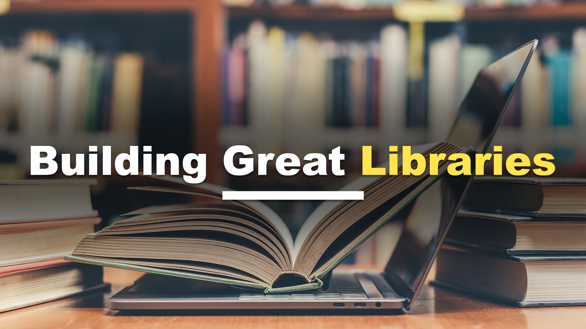

## Abstract
“Bad libraries build collections; good libraries build services; great libraries build communities.” Whether you are building a class library containing common functionality to use within your company’s products, a class library for your customers to be able to use your services, or the next great open-source project; you should take great care when building a class library so that it is easy to use and widely adopted.  During this session, we will talk about coding standards you should apply, documentation, dependencies, publishing, versioning, and handling breaking changes so that you can build class libraries that developers will enjoy using instead of those they curse at.

## Short Abstract
Learn how build class libraries that developers will enjoy using instead of those they curse at by applying best practices.

# Type
* 45/60/75-minute session

## Tags
* .NET
* APIs
* Architecture
* Best Practices
* C#
* Software Design

## Learning Objectives
* Learn how to apply coding standards and best practices to build class libraries usable by many
* Learn how to version your class libraries in order to make changes while not breaking functionality for others
* Learn how to publish your class libraries so potential users can find them

## Presentations

| Event | Location | Date | Time | Room | Downloads |
|-------|:--------:|-----:|-----:|-----:|----------:|
| [Nebraska.Code()](https://nebraskacode.amegala.com/) | Lincoln, NE | July 20, 2023 | 1:00 pm CDT | Lancaster 4 | Available Afterwards |